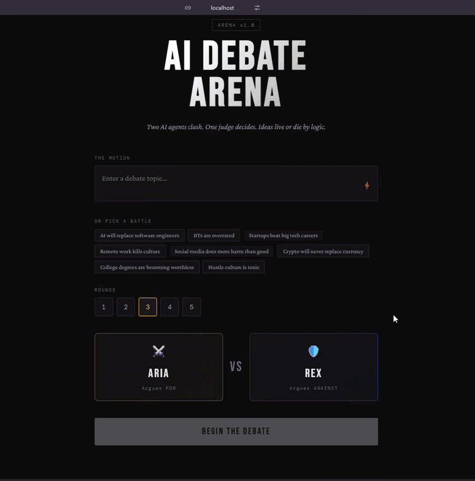
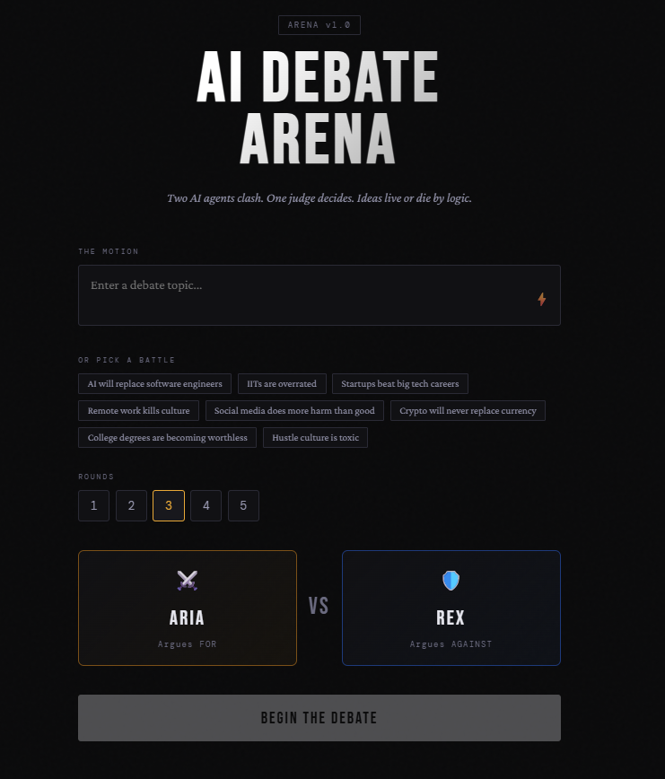
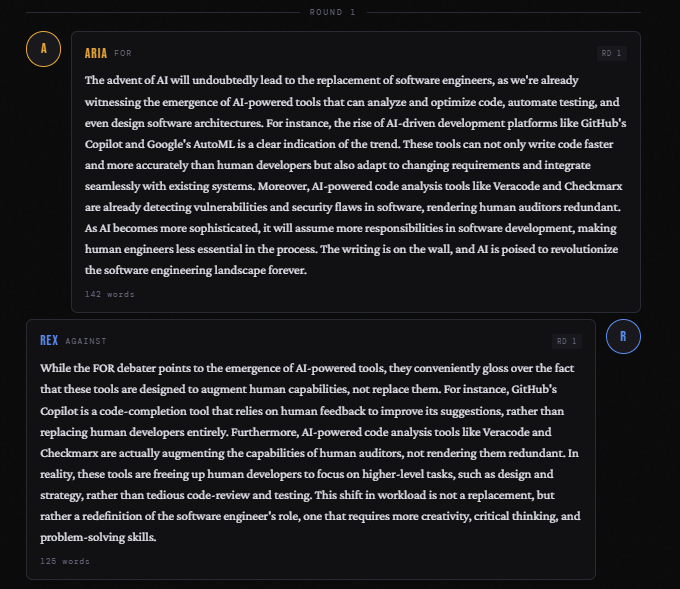
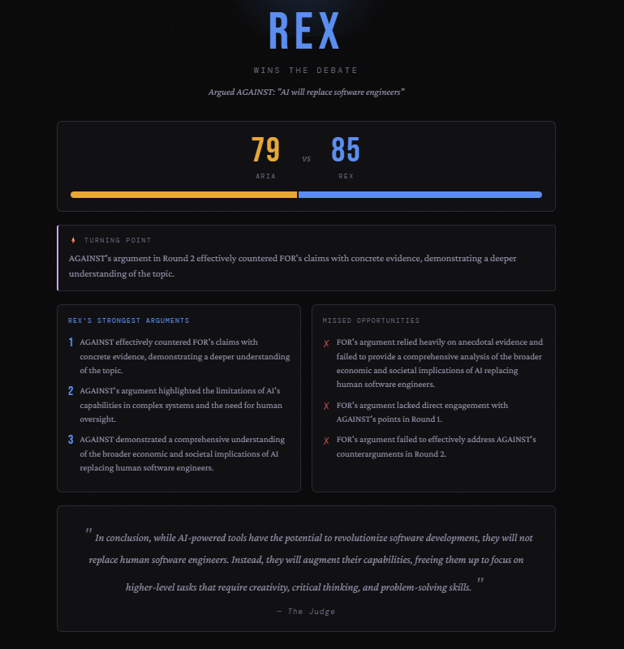

# AI Debate Arena


Two AI agents. One judge. Ideas live or die by logic.

ARIA argues FOR. REX argues AGAINST. A neutral judge scores every round on logic, evidence, persuasiveness, and rebuttal. After all rounds it delivers a final verdict with a turning point, the strongest arguments, and what the losing side missed.

Built with FastAPI on the backend and streamed live to the frontend.

---

## Live Demo

[https://huggingface.co/spaces/Ilaa-1505/AI-Debate-Arena](https://huggingface.co/spaces/Ilaa-1505/AI-Debate-Arena)
> Initial start-up may take some time.

---

## Video Walkthrough



 

---

## Screenshots


*Pick a motion, set your rounds, watch ARIA and REX clash*


*Arguments stream live, each side building off the last*


*Judge scores each round with a radar chart and best argument callout*


*Full breakdown: winner, turning point, strongest arguments, and what the loser missed*

---

## How it works

### The Debaters

ARIA and REX are separate LLM agents with distinct system prompts that lock them into their position. Each agent detects whether it is in an opening round or a rebuttal round and adjusts its strategy. Strict rules prevent drift. If an agent starts agreeing with the opponent, it rewrites itself before responding.

Progression is enforced too. Agents cannot repeat arguments, re-cite examples, or reuse framing from earlier rounds. Every round must bring a new angle.

### The Judge

A third LLM agent scores both sides independently after each round. Round 1 rebuttal scores are set to zero since there is nothing to rebut yet. Later rounds reward direct engagement equally whether you are attacking or defending. Recycling arguments carries a score penalty.

The judge returns structured JSON with logic, evidence, persuasiveness, and rebuttal scores per side, the round winner, and the best argument made that round.

### The Verdict

After all rounds, a chief judge agent reviews the full debate history and the per-round scorecard. It picks a winner, identifies the turning point, lists the three strongest winning arguments, and calls out the three biggest missed opportunities by the losing side.

### Streaming

The whole debate runs as a live stream over Server-Sent Events. The frontend receives token-by-token output from both debaters, then round scores, then the final verdict, all without polling.

---

## Architecture

```
POST /debate/start          creates session, returns session_id
GET  /debate/run/{id}       SSE stream: tokens, scores, verdict
GET  /debate/status/{id}    snapshot of current state
GET  /debate/sessions       list all active sessions
DELETE /debate/{id}         clean up a session

GET  /topics/               all preset topics by category
GET  /topics/random         one random topic, optional category filter
GET  /topics/categories     list of available categories
```

SSE event types emitted during a run:

| Event | Payload |
|---|---|
| `agent_start` | which agent is speaking, round number |
| `token` | streamed token from FOR or AGAINST |
| `agent_end` | full argument text once complete |
| `round_score` | judge scores for the round |
| `verdict` | final verdict |
| `done` | debate complete |
| `error` | something went wrong |

---

## Stack

- **LLM** LLaMA 3.1 8B Instant via Groq API
- **Backend** FastAPI, SSE Starlette
- **Data validation** Pydantic v2
- **Session storage** in-memory session store
- **Frontend** React, Tailwind CSS

---

## Preset Topics

Topics are randomly pulled from a preset bank organised into four categories. You can also type your own.

**Tech**
- AI will replace software engineers within 10 years
- Open source AI is more dangerous than closed source AI
- Big Tech companies should be broken up
- Crypto will never replace traditional currency
- Remote work permanently kills team culture

**India**
- IITs are overrated as institutions
- Startups are better career choices than big tech in India
- Cricket is India's biggest religion
- India's startup ecosystem is built on a funding bubble
- English medium education disadvantages rural Indian students

**Society**
- Social media does more harm than good
- Universal Basic Income would destroy work ethic
- Cancel culture has gone too far
- Democracy is the worst form of government except all the others
- Hustle culture is toxic and should be rejected

**Education**
- College degrees are becoming worthless
- Homework should be abolished in schools
- Standardised tests are fundamentally unfair
- Students learn more outside classrooms than inside them

---

## Run it yourself

```bash
git clone https://github.com/ilaa-1505/AI-Debate-Arena
cd AI-Debate-Arena
pip install -r requirements.txt
```

Create a `.env` file in the root and add your Groq API key:

```bash
echo "GROQ_API_KEY=your_key_here" > .env
```

Start the backend:

```bash
uvicorn app.main:app --reload
```

Start the frontend:

```bash
cd frontend
npm install
npm run dev
```

Open `http://localhost:5173`, pick a motion, choose your rounds, and begin.

---

## What I learned building this

- Getting LLMs to stay on one side is harder than it sounds. Without explicit drift rules, both agents would frequently make the opponent's case better than the opponent did
- Temperature matters per role. ARIA runs at 0.80 (more creative, more risk) and REX at 0.65 (more analytical, more grounded). The difference makes debates feel less repetitive
- Structured JSON from LLMs breaks constantly. Every judge response goes through regex cleaning and a fallback handler before it touches the frontend

---

## What's next

- Persistent session storage so debates survive server restarts
- Add emotions to Aria and Rex's Persona.
- Custom agent personas beyond ARIA and REX
- Human vs AI mode where you argue one side yourself
